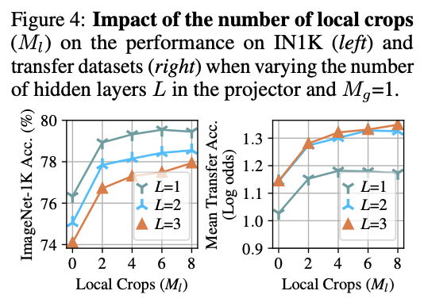

# Impact of Augmentations on Tunnel Effect

A project building off of findings from https://arxiv.org/abs/2405.15018

Usage
-------------
### Backbone Training
To train a specific backbone model (ie: ResNet-18) from scratch using a preset augmentation setting, use the following cmd: 

`python backbone.py --model MODEL_NUM --backbone_pth BACKBONE_SAVE_PATH
--dataset DATASET_NAME --classes NUM_CLASSES --aug_setting AUG_SETTING --num_unique NUM_UNIQUE_SAMPLES --batch_size BATCH_SIZE --lr LEARNING_RATE --num_epochs NUM_EPOCHS --warmup_epochs NUM_WARMUP_EPOCHS --use_cos_annealing [true,false] --cuda_devices [DEVICE IDS] --use_writer [true,false]`

Backbone Models (configured based on number of classes):

0. ResNet-18

Augmentation Settings:

0. None
1. Random Horizontal Flip (p=0.5)
2. Random Resize Crop (p=0.5)
3. 1, 2, 1+2, Random Grayscale (all p=0.25)

Unique Training Samples Settings (where N is training size):

0. N unique
1. 3N/4 unique
2. N/2 unique
3. N/4 unique

### Probe Training

To train a linear probe,  from scratch using a preset augmentation setting, use the following cmd: 

`python probe.py --probe_num PROBE_TYPE_NUMBER --backbone_pth BACKBONE_PATH --probe_pth PROBE_SAVE_PATH
--dataset DATASET_NAME --classes NUM_CLASSES --batch_size BATCH_SIZE --lr LEARNING_RATE --num_epochs NUM_EPOCHS --warmup_epochs NUM_WARMUP_EPOCHS --use_cos_annealing [true,false] --cuda_devices [DEVICE IDS] --use_writer [true,false]`

Probe Types:

0. Linear Projection Head (trainable 1 layer MLP)
1. Linear Projection Head (trainable 2 layer MLP)
2. Linear Projection Head (trainable 3 layer MLP)
    - found to work best in (https://arxiv.org/abs/2206.15369) for downstream linear probing at the cost of backbone acc:
    

# Experiments

### Backbone Experiments

**Note**: $N$ is training sample size
1.  Fixed #unique, varying aug. Dataset: IN100
    
    Models used:

    0. ResNet18 (no-aug, unique = N)
    1. ResNet18 (det aug 1 unique = N)
        - Transforms.RandomHorizontalFlip(p=0.5)
    2. ResNet18 (det aug 2 unique = N)
        - Transforms.RandomResizedCrop((224,224)) (p=0.5 by spliting dataset, applying aug, combining)
    3. ResNet18 (det aug 3 unique = N)
        - Transforms.RandomHorizontalFlip(p=0.25),
        - Transforms.RandomResizedCrop((224,224)) (p=0.25),
        - a+b (p=0.25),
        - Transforms.RandomGrayscale(p=0.25)

2.  #unique = $(V_l+V_s)*N$ and $V_l = 2$, SwAV aug. Dataset: IN100
    
    **where**: $V_s$ denotes number of low res views, $V_l$ denotes number of global views

    Models used:
    
    0. ResNet18 ($G=2, V=0$): 0.8494

3.  Fixed #unique, Barlow aug. Dataset: IN100
    
    Models used:

    0. ResNet18 ($total_views = 2$): 0.8503
--------------------------------------------------------------------
### Linear Probe Experiments
Note: x.x represents experiment#.backbone#

1. ID Dataset: IN100, OOD Datasets = {CIFAR10, Flowers102, STL-10, Aircrafts, CUB-200}: CIFAR10, N = len(training_data)
    
    0. 1.0 (unique samples = N)
    1. 1.1 (unique samples = N)
    2. 1.2 (unique samples = N)
    3. 1.3 (unique samples = N)

2. ID Dataset: IN100, OOD Datasets = {CIFAR10, Flowers102, STL-10, Aircrafts, CUB-200}: CIFAR10, N = len(training_data)
    
    0. 2.0 (unique samples = N)
    1. 2.1 (unique samples = N)
    2. 2.2 (unique samples = N)
    3. 2.3 (unique samples = N)

3. ID Dataset: IN100, OOD Datasets = {CIFAR10, Flowers102, STL-10, Aircrafts, CUB-200}: CIFAR10, N = len(training_data)
    
    0. 3.0 (unique samples = N)
    1. 3.1 (unique samples = N)
    2. 3.2 (unique samples = N)
    3. 3.3 (unique samples = N)

## TODO:

1. Setup wandb
2. Setup and test aug booster
3. Figure out backbone experiments (aug combos)

    1. aug combos
    2. probabilities (not ratios)
    3. scale down to 32 x 32
    4. test out and analyze results on some manual augs (record aug configs as inputs into SHAP)
    5. add in more architectures (VGG, DenseNet, etc)

4. Re-run probes

    1. more OOD datasets (eventually audio)
    2. Predict % OOD performance retained, Pearson Correlation, ID/OOD alignmentbased on probe results

5. Build GB SHAP model, collect all ID/OOD results, and run through it
6. Peform analysis based on trained SHAP, if more analysis is needed, use 224 x 224 for those experiments.
